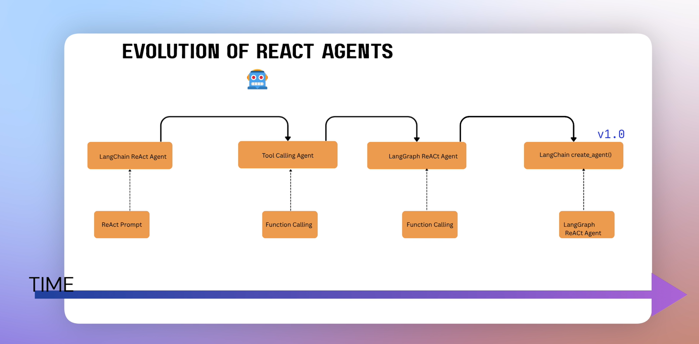

The evolution of ReAct (Reason + Act) agents has completely shifted how we build production AI applications. We went from parsing raw strings with fragile regular expressions to compiled state-machines that can run enterprise workflows.

## 🧬 The Evolution of ReAct Agents

In production, agents have evolved from unpredictable text-based loops to rigid, reliable, state-driven architectures. Understanding this evolution is crucial for passing advanced AI engineering interviews.

### The 4 Generations of Agents

**1. Classic ReAct (Text-Parsing) Agents**

> The original 2022 paradigm. The LLM was given a strict text prompt instructing it to output a specific format: `Thought: ...`, `Action: ...`, `Action Input: ...`. The backend Python code used Regex to parse these strings, extract the tool name, and run it.
>
> - _The Flaw:_ Incredibly fragile. If the LLM missed a colon or changed "Action Input" to "Arguments", the Regex broke, and the application crashed.

**2. JSON & Structured Chat Agents**

> The first major upgrade. Instead of raw text, developers forced the LLM to output a valid JSON object matching a specific schema for tool execution.
>
> - _The Flaw:_ Better, but LLMs still frequently wrapped JSON in markdown blocks (`json ... `) or missed commas under heavy prompt pressure, causing parsing exceptions.

**3. Native Function / Tool Calling Agents**

> Introduced by OpenAI (and later adopted by Anthropic and Google). Instead of relying on prompt engineering to force JSON, the model providers modified the model's decoding layer. The API accepts an explicit list of tools, and the model natively outputs structured tool arguments via grammar-constrained sampling.
>
> - _The Win:_ This eliminated 95% of parsing errors and made single-agent tool use production-ready.

**4. Stateful Graph Agents (LangGraph / Multi-Agent Systems)**

> The modern era. Single-agent loops are bounded by the context window and general confusion when tasks get complex. Modern architectures break large problems into a **Graph** of specialized agents (e.g., a Writer Agent, a Critic Agent, a Researcher Agent) that pass a shared state container back and forth.

## 

### ⚙️ Architectural Comparison

| Feature               | Classic ReAct Agent           | Tool Calling Agent            | LangGraph State-Machine                  |
| :-------------------- | :---------------------------- | :---------------------------- | :--------------------------------------- |
| **Parsing Mechanism** | Regex / String manipulation   | Native API Schema             | Native API + Compiled State Graph        |
| **Flow Control**      | Purely decided by LLM         | Purely decided by LLM         | Hybrid (Deterministic code + LLM choice) |
| **State Management**  | Appended to flat chat history | Appended to flat chat history | Centralized, persistent State Object     |
| **Max Complexity**    | 1-2 basic tools               | 3-5 tools before degradation  | Unlimited (Modular sub-graphs)           |

---

## 🧠 Interview Prep: Agent Architectures

### Practice Questions

<b>Q1: Why did the industry move away from the classic LangChain `initialize_agent` syntax to LangGraph?</b> (Click to reveal)

 

The legacy `initialize_agent` method created a "black box" ReAct loop. You passed it tools, and you had zero control over the execution flow once it started.

**Why LangGraph won:**

- **Deterministic Guardrails:** In production, you don't want an agent to have absolute freedom. LangGraph allows you to force an agent to go through specific code steps (e.g., _Always validate tool arguments with Python code before executing the tool_).
- **Time Travel & Persistence:** LangGraph treats the conversation as a persistent database state. You can pause execution, ask a human for approval (human-in-the-loop), and resume or even rewind the agent to a previous state.
- **Maintainability:** It shifts agent design from complex prompt engineering to clean software engineering (Nodes and Edges).

**How to say it in an interview:**
_"Legacy ReAct agents were too unpredictable for enterprise use because the LLM controlled both reasoning and execution routing. LangGraph separates them: we use standard Python code to control the graph layout (the edges and conditions), and we use the LLM strictly for localized decisions within a node. This gives us predictable control with agentic flexibility."_

<b>Q2: What is "Native Tool Calling" and how does it differ from prompt-based tool selection?</b> (Click to reveal)

 

Prompt-based tool selection relies entirely on the LLM's ability to follow written instructions in the system prompt. Native Tool Calling bypasses the standard generation layer.

When a model is fine-tuned for tool calling, the provider adjusts the model's training so that when a tool condition is met, it starts generating tokens that fit a structured schema directly. This ensures that the structure of the payload is strictly valid, preventing formatting errors before the text is even fully generated.

<b>Q3: Explain the concept of "Human-in-the-loop" in modern agentic workflows.</b> (Click to reveal)

 

Human-in-the-loop (HITL) means the agent must halt execution and await manual human confirmation before executing sensitive actions (like sending an email, executing a financial transaction, or running a database deletion script).

**How it works structurally:**

1. The agent reaches a node that requires authorization.
2. The framework writes the current state to a checkpoint database and interrupts execution.
3. An API endpoint alerts a human operator via a UI dashboard.
4. The human clicks "Approve" or "Modify".
5. The framework wakes up, updates the state with the human's input, and continues to the next node.

