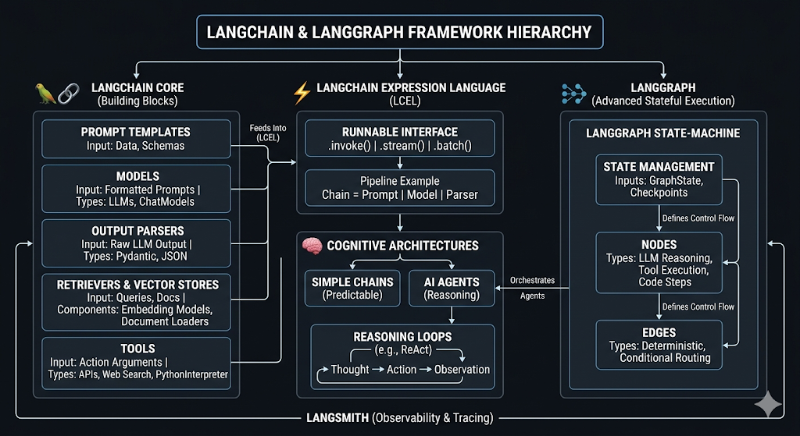

---

## 🗺️ The LangChain Ecosystem: The Bird's-Eye View

Alright, let's break down this architecture. When you walk into an AI engineering interview, you cannot just say "I built an app with LangChain." You need to prove you understand the stack layer by layer.

Think of this framework not as a single library, but as a five-layer cake. Here is exactly how data flows from a raw string to a fully autonomous enterprise agent.

### Layer 1: LangChain Core (The Primitives)

These are your raw ingredients—the Lego bricks of your application.

- **Prompt Templates:** The formatting engine. They take raw data and schemas as inputs and output a strictly formatted string or message array.
- **Models (LLMs & ChatModels):** The actual reasoning engines (like Azure OpenAI or Claude). They take that formatted prompt and return raw text.
- **Output Parsers:** The safety net. They take the raw LLM output and cast it into structured Python objects (like Pydantic models).
- **Retrievers & Vector Stores:** The memory banks. This is where your RAG (Retrieval-Augmented Generation) lives.
- **Tools:** The hands of the LLM. These are Python functions (API calls, SQL queries) that the LLM can trigger.

### Layer 2: LCEL (The Glue)

Having bricks is great, but you need mortar. **LangChain Expression Language (LCEL)** is the syntax that binds the Core primitives together using the pipe operator (`|`).

- Under the hood, this works because every component implements the **Runnable Interface**.
- Because they all share this interface, the moment you pipe a Prompt to a Model (`prompt | model`), you instantly inherit production-grade methods: `.invoke()`, `.stream()`, and `.batch()`.

### Layer 3: Cognitive Architectures (The Brain)

Once you have your chained components, you have to decide how they behave.

- **Simple Chains:** Predictable, one-way streets. Data goes from A → B → C.
- **AI Agents:** You give the LLM a goal and a toolbox, and it enters a **Reasoning Loop** (Thought → Action → Observation). It decides on its own how to route the data.

### Layer 4: LangGraph (The Enterprise State Machine)

Agents built with standard LangChain (Layer 3) are notoriously chaotic in production. They get stuck in loops and forget context. **LangGraph** solves this by treating the agent not as a wild loop, but as a strict, compiled state machine.

- **State:** A centralized, persistent memory object (like a Python TypedDict) that gets passed around.
- **Nodes:** Standard Python functions or LLM calls that do the actual work and update the State.
- **Edges:** The routing logic (conditional statements) that dictate which Node runs next.

### Layer 5: LangSmith (The X-Ray)

Wrapping around _everything_ is LangSmith. If you build an agent without observability, you are flying blind. LangSmith traces every single execution, showing exactly what went into the prompt, how long the model took to think, and where the parser crashed.

---

## 🧠 Interview Prep: The Ecosystem

<b>Q1: Can you explain the difference between LangChain and LangGraph? Why use both?</b> (Click to reveal)

 

**How to answer in an interview:**
_"LangChain provides the primitive building blocks—it’s how I format a prompt, connect to Azure OpenAI, and parse the output into JSON. But when I need to build an autonomous agent, standard LangChain agent loops are too opaque. I use LangGraph to orchestrate those LangChain blocks into a predictable state machine. LangChain is the components; LangGraph is the control flow."_

<b>Q2: Where does LCEL fit into a LangGraph architecture? Do you stop using LCEL if you use LangGraph?</b> (Click to reveal)

 

No, you use them together!

In LangGraph, the execution flows from Node to Node. But _inside_ a single Node, the actual work being done is almost always an LCEL chain.

For example, a Node called `generate_summary` might internally run:
`chain = prompt | llm | output_parser`
`return chain.invoke(state["documents"])`

<b>Q3: If a production agent makes a mistake, how do you debug it using this architecture?</b> (Click to reveal)

 

**The ultimate Senior Engineer answer:**
_"First, I look at the **LangSmith** trace to pinpoint the exact failure. Did the LLM hallucinate, or did the Output Parser fail?
If it's a parsing issue, I adjust the LangChain core prompt or schema.
If it's a logic issue—like the agent getting stuck in a loop—I don't just rely on prompt engineering. I go to the **LangGraph** layer and write deterministic Python code in an Edge to forcefully route the agent away from the error state."_

